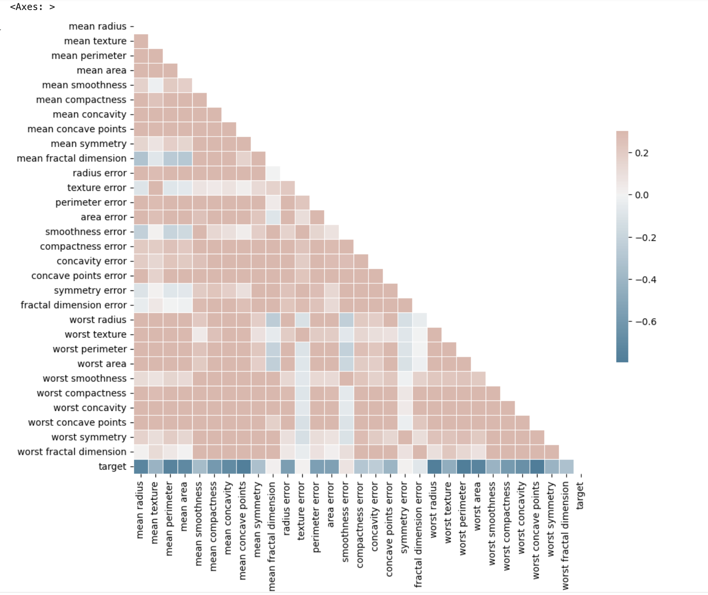

# Using a Neural Network to identify malignant cancer cells

The project uses the [scikit-learn breast cancer dataset](https://scikit-learn.org/stable/modules/generated/sklearn.datasets.load_breast_cancer.html#sklearn.datasets.load_breast_cancer).

## Description


## Intended Use

## Limitations
Source dataset only consists of 569 samples (212 malignant cells, 357 Benign cells), and a large dimensionality of 30.
The approach can be refined by selecting most relevant dimensions to train the classifier model, and by training on a larger more balanced dataset.

The "kitchen sink" GridSearch will take considerably longer with a larger dataset.

## Training Procedure

### Feature Selection

#### Correlation of dimensions to target and one another



### Procedure

The breast cancer dataset is split into 60% training data and 40% testing data
Data is then standardized using the StandardScaler library and GridSearchCV is used to find the best combination of hyperparameters for the Scikit-learn MLP classifier in a "kitchen sink" approach to finding the model that produces the best f1 score.

## Hyperparameters

```
        param_grid = {
        "activation":['identity', 'logistic', 'tanh', 'relu'],
        "solver":['lbfgs','sgd','adam'],
        "learning_rate":['constant','invscaling','adaptive'],
        "max_iter":[100000000],
        "early_stopping": [True]
    }
```

